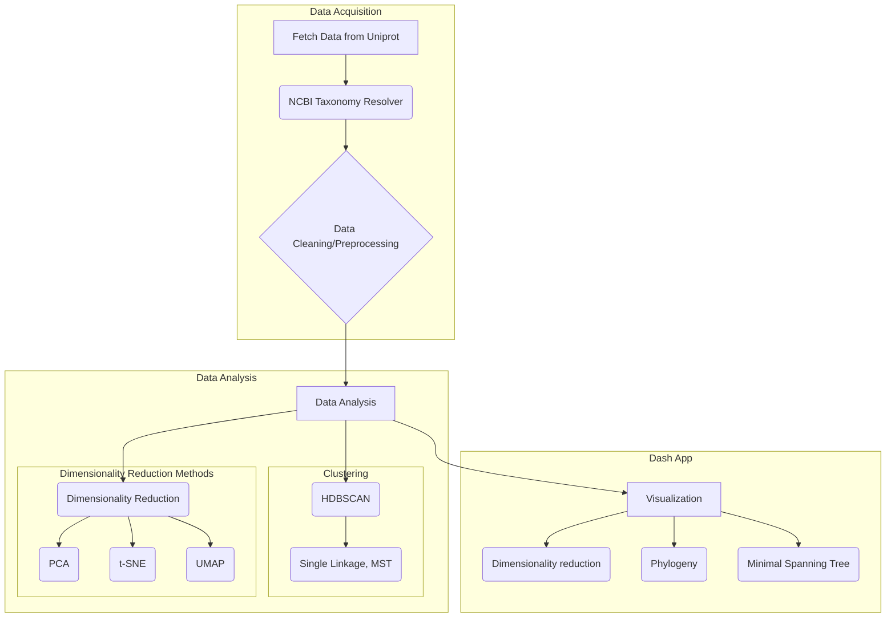

# EnzyNavi
Explore and navigate protein sequence space interactively.

## Install
For optimal GPU support, the conda installation is reccommended.
Please clone the repository:
```
git clone https://github.com/fmoorhof/ec.git
cd ec
```

### Conda
For optimal GPU support, the conda installation is reccommended.
```
conda env create -f environment.yml
# in case some pip dependencies could not be installed use:
pip install -e .
```

### Pip
```
pip install -r requirements.txt --extra-index-url https://download.pytorch.org/whl/cu118
pip install --extra-index-url=https://pypi.nvidia.com cudf-cu11==24.2.* cuml-cu11==24.2.*
```
Note: Please install RAPIDSAI CuMl and CuDf manually since otherwise the entire extra-index is installed and that causes the docker containers or CI runner to exit on: `OSError: [Errno 28] No space left on device`  

Outlook: pass extra-index-url in pyproject.toml. Doesnt work for me yet!
```
# local installation of the package:
pip install .

# editable install:
pip install -e .

# editable install with optional dependencies:
pip install -e `.[full]`

# on failure, provide extra package indices manually:
pip install -r requirements.txt --extra-index-url=https://pypi.nvidia.com --extra-index-url https://download.pytorch.org/whl/cu118
```

### Docker
```
docker build -t fmoorhof/selectzyme:rapids23.06-cuda11.8-base-ubuntu22.04-py3.10 .
docker run --gpus all -it -p 8050:8050 --entrypoint /bin/bash fmoorhof/selectzyme:rapids23.06-cuda11.8-base-ubuntu22.04-py3.10
```
You can now access the app via your web browser by typing either the *server_IP* or *localhost* and the exposed port (8050):
`http://localhost:8050` or `http://server_IP:8050`

```
# optional: re-start your container later;  (find CONTAINERID with `docker ps` or `docker ps -a`)
docker start CONTAINERID
docker exec -it CONTAINERID /bin/bash
```

#### Advanced usage
For extensive usage you might want to setup the Qdrant vector database in a separate docker container. Qdrant suggest to only save up to 20,000 vectors locally and the access time is indeed very slow. However, there is no need to do so, i also once stored up to 1M vectors locally:D
A nice and very simple manual how to do so is provided [here](https://qdrant.tech/documentation/quickstart/#)
keep in mind to also adapt the codebase accordingly and set the
`QdrantClient(url="http://localhost:6333")`


## Usage
```
conda activate selectzyme
# use config.yml files (reccommended for reproducibly saving input)
python app.py --config=results/test_config.yml
# or parameter passing
python src/main.py -p 'argparse_test' -q="ec:1.13.11.85" -q "ec:1.13.11.84" --length '200 TO 601' -loc "/raid/data/fmoorhof/PhD/SideShit/LCP/custom_seqs_no_signals.csv" -o 'argparse_test'
```
Please pay attention if using multiple query words to repeat the `-p` the argument. Please also specify protein sequence length filters in the mentioned format 'from TO to'

Additional information about the parsing options can be displayed by:
```
python src/main.py -h
```

## Core functionality


#### Development tools
This project uses the following tools to improve code quality:
- [black](https://black.readthedocs.io/) for code formatting
- [isort](https://pycqa.github.io/isort/) for sorting imports
- [flake8](https://flake8.pycqa.org/) for style guide enforcement
- [pytest](https://docs.pytest.org/) for testing
- [pytest-cov](https://github.com/pytest-dev/pytest-cov) for measuring code coverage


# License
OpenGPL 3.0 License