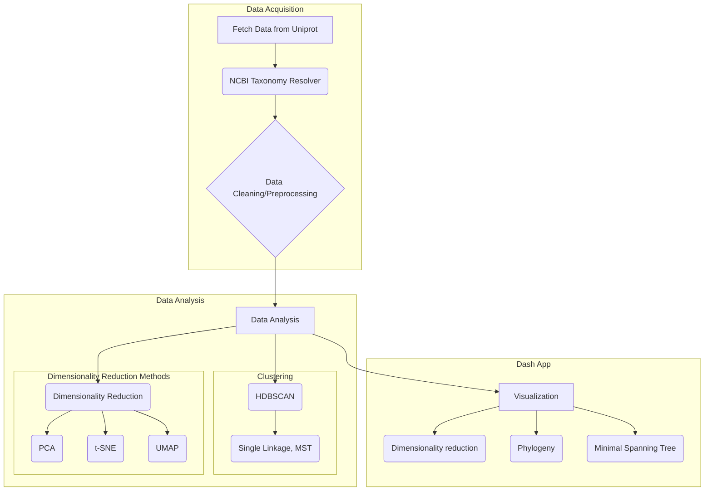

# EnzyNavi
Explore and navigate protein sequence space interactively.

## Install
For optimal GPU support, the conda installation is reccommended.
Please clone the repository:
```
git clone https://github.com/fmoorhof/ec.git
cd ec
```

### Conda
Reccommended for optimal and easy GPU support.
```
conda env create -f environment.yml
conda activate selectzyme
```

### Pip
```
pip install --extra-index-url=https://pypi.nvidia.com cudf-cu11==24.2.* cuml-cu11==24.2.*
pip install . --extra-index-url=https://pypi.nvidia.com --extra-index-url https://download.pytorch.org/whl/cu118
```
Note: Please install RAPIDSAI CuMl and CuDf manually since otherwise the entire extra-index is installed and that causes the docker containers or CI runner to exit on: `OSError: [Errno 28] No space left on device`  

### Docker
```
docker build -t fmoorhof/selectzyme:rapids23.06-cuda11.8-base-ubuntu22.04-py3.10 .
docker run --gpus all -it -p 8050:8050 --entrypoint /bin/bash fmoorhof/selectzyme:rapids23.06-cuda11.8-base-ubuntu22.04-py3.10
```
You can now access the app via your web browser by typing either the *server_IP* or *localhost* and the exposed port (8050):
`http://localhost:8050` or `http://server_IP:8050`

```
# optional: re-start your container later;  (find CONTAINERID with `docker ps` or `docker ps -a`)
docker start CONTAINERID
docker exec -it CONTAINERID /bin/bash
```

## Usage
```
python app.py --config=results/test_config.yml
```
You can seamlessly edit or create new `config.yml` files for your jobs. 

### Extensive usage
For extensive usage you might want to setup the Qdrant vector database in a separate docker container. Qdrant suggest to only save up to 20,000 vectors locally and the access time is indeed very slow. However, there is no need to do so, i also once stored up to 1M vectors locally.
A nice and very simple manual how to do so is provided [here](https://qdrant.tech/documentation/quickstart/#)
keep in mind to also adapt the codebase accordingly and set the
`QdrantClient(url="http://localhost:6333")`

## Core functionality


#### Development tools
This project uses the following tools to improve code quality:
- [black](https://black.readthedocs.io/) for code formatting
- [isort](https://pycqa.github.io/isort/) for sorting imports
- [flake8](https://flake8.pycqa.org/) for style guide enforcement
- [pytest](https://docs.pytest.org/) for testing
- [pytest-cov](https://github.com/pytest-dev/pytest-cov) for measuring code coverage


# License
OpenGPL 3.0 License