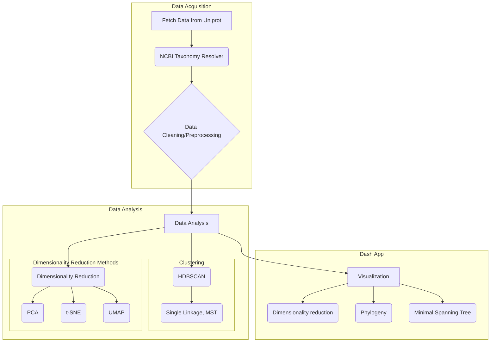

# SelectZyme
Explore and navigate enzyme sequence space interactively.

## Install
For optimal GPU support, the conda installation is recommended.
Please clone the repository:
```
git clone https://github.com/ipb-halle/SelectZyme.git
cd SelectZyme
```

### Conda
Reccommended for optimal and easy GPU support.
```
conda env create -f environment.yml
conda activate selectzyme
```

### Pip
```
pip install --extra-index-url=https://pypi.nvidia.com cudf-cu11==24.2.* cuml-cu11==24.2.*
pip install -e . --extra-index-url https://download.pytorch.org/whl/cu118
```
Note: Please install RAPIDSAI CuMl and CuDf manually since otherwise the entire extra-index is installed and that causes the docker containers or CI runner to exit on: `OSError: [Errno 28] No space left on device`  

### Docker
```
docker build -t ipb-halle/selectzyme:rapids23.06-cuda11.8-base-ubuntu22.04-py3.10 .
docker run --gpus all -it -p 8050:8050 --entrypoint /bin/bash ipb-halle/selectzyme:rapids23.06-cuda11.8-base-ubuntu22.04-py3.10
```

```
# optional: re-start your container later;  (find CONTAINERID with `docker ps` or `docker ps -a`)
docker start CONTAINERID
docker exec -it CONTAINERID /bin/bash
```

## Test the install
Run some unit tests to see if SelectZyme got setup properly on your system.
```
python -m pytest tests/test_* -v
```
On failure please look at the (closed) issues for troubleshooting and solutions see also [#41](/../../issues/41).

## Usage
### Intended usage
```
python app.py --config=results/input_configs/test_config.yml
```
For better overview about input parameters, you need to specify them in a `config.yml` file. An example is provided in the results folder. All outputs will also be written to the results folder, including a .tsv file with your project:name containing the sequences you retrieved from UniProt. 

> [!IMPORTANT]  
> If you re-run the job this file will be parsed and UniProt will NOT be queried again!. If you changed some `query_terms` in the config and you want to retrieve data you either need to delete the .tsv file or provide another project:name

The terminal output will inform you about the execution status. Once done you can click on the URL to open the app via your web browser. Alternatively, you can access by typing either your *server_IP* or *localhost* and the exposed `port` (8050), you defined in the `config.yml`:
`http://localhost:8050` or `http://server_IP:8050`

To run your custom searches, seamlessly edit or create new `config.yml` files for your different jobs. 

### Extensive usage
For extensive usage you might want to setup the Qdrant vector database in a separate docker container. Qdrant suggest to only save up to 20,000 vectors locally and the access time is indeed very slow. However, there is no need to do so, i also once stored up to 1M vectors locally.
A nice and very simple manual how to do so is provided [here](https://qdrant.tech/documentation/quickstart/#)
keep in mind to also adapt the codebase accordingly and set the
`QdrantClient(url="http://localhost:6333")`

### Jupyter notebook
We also prepared a juypter notebook for initial explorations of individual plots. However, enzyme selection is not possible within the notebook and the above 'intended usage' is recommended.
The minimal jupyter notebook can be found [here](https://github.com/fmoorhof/SelectZyme/blob/main/minimal_example.ipynb) 


## Custom data upload
Data can be uploaded in the form of `.fasta, .tsv, .csv`
If `.tsv, .csv` there MUST be a column called 'accession' (a unique ID for your entry) an d a column 'sequence', containing the protein sequence. All additional columns will be available for visualization but as minimal information an accession and sequence is needed. For the .fasta files also additional information can be provided by field separator '|'
```{.fasta}
>ID|Info1|Info n...
PRTN
```

## Core functionality


#### Development tools
This project uses the following tools to improve code quality:
- [ruff](https://docs.astral.sh/ruff/tutorial/)
- [pytest-cov](https://github.com/pytest-dev/pytest-cov)

# License
OpenGPL 3.0 License